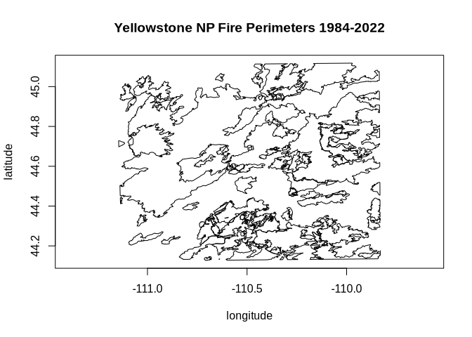

```{r, include = FALSE}
knitr::opts_chunk$set(
  collapse = TRUE,
  comment = "#>"
)
```

DRAFT: last updated 2026-05-16

Conda is an open-source, cross-platform, language-agnostic package manager and environment management system. It was originally developed to solve package management challenges faced by Python data scientists, and today is a popular package manager for Python and R [[Wikipedia](https://en.wikipedia.org/wiki/Conda_(package_manager))].

Conda uses the concept of channels as the base for hosting and managing packages. Conda is often associated with the commercial company Anaconda which provides the [Anaconda.org](https://anaconda.org/) channel of packages. Alternatively, the conda-forge project builds and distributes packages via [conda-forge.org](https://conda-forge.org/), specializing in hard-to-build or unique packages that often arise in a scientific computing context. Conda-forge is community-driven and community-curated. Both conda and conda-forge are [NumFocus-affiliated](https://numfocus.org/project/conda-forge) projects.

Conda offers features potentially of interest to R users who work with geospatial data:

* install different versions of binary software packages and required dependencies on multiple supported platforms
* assemble sets of packages in isolation from the rest of the computing platform using environments
* manage and switch between environments that use various packages for different projects
* access to current R or previous release version, a large number of CRAN packages, and current GDAL with dependencies
* benefit from lightweight [modular GDAL packaging](https://quansight.com/post/introducing-lightweight-versions-of-gdal-and-pdal/) based on deferred plugin loading
* available plugins include format drivers that sometimes are not available in other package managers, such as the Arrow and Parquet vector drivers

Conda-forge provides pre-compiled binary packages for **gdalraster** that track CRAN releases, for the following platforms:

[](https://anaconda.org/conda-forge/r-gdalraster)


## Installation

Install Miniforge: https://conda-forge.org/download/

The webpage provides links to the installer for each supported platform along with basic installation instructions. For more detailed instructions, see https://github.com/conda-forge/miniforge.

Other conda distributions could also be used. Conda-forge recommends the use of Miniforge instead of the Anaconda Distribution to reduce chances of unsolvable/conflicting installations, and it is also a smaller download.

On Linux, at the end of the installation you will prompted with:

```bash
$ Proceed with initialization? [yes|no]
```

Enter `yes` for correct setup of the `PATH` environment variable in your `.bashrc` file, but also note the command given along with that prompt, which can be used to undo this later if you choose:

```bash
conda config --set auto_activate_base false
```

You can also use the command `conda deactivate` to deactivate the `conda` base environment in your shell at any time, if needed, and `conda activate` to re-activate it.

## Working with conda environments

Environments in `conda` are self-contained, isolated spaces where you can install specific versions of Python and R along with packages and their dependencies. Conda provides a comprehensive feature set for managing environments. You can create, export, list, remove, and update environments that have different versions of software installed in them. Switching or moving between environments is called activating the environment.

More information on environments can be found in the documentation from Anaconda:

https://www.anaconda.com/docs/getting-started/working-with-conda/environments

## Creating a new environment for R

The syntax for creating and activating a new environment in the terminal is:

```bash
conda create --name <ENV_NAME> [package1] [package2] [...]
conda activate <ENV_NAME>
```

When creating a new environment, you can add R by explicitly including `r-base` in the list of packages. The `r-essentials` package is a bundle of commonly used R packages, which importantly, also includes the `r-recommended` bundle (i.e., the packages `graphics`, `methods`, `stats`, `tools`, `utils`, etc. that are normally included with base R).

The example below creates an R environment named `r_env` with **gdalraster** included. The package channel can be specified with `--channel conda-forge`, or here using short names `-c`, and `-n` for the environment `--name`. The command `conda list` will print a list of all installed packages in the activated environment.

```bash
conda create -c conda-forge -n r_env r-base r-essentials r-gdalraster
conda activate r_env
conda list
```

Note that conda-forge is the default channel in Miniforge, so it could be omitted here. It would need to be specified explicitly as shown above if a different `conda` distribution is used.

TODO: package installation, embrace the conda package manager!

R package names in conda-forge always have the `r-` prefix. A web portal for exploring packages available in conda-forge can be found at: https://conda-forge.org/packages/.

## GDAL installation in conda

GDAL is available in conda-forge as a modular set of packages that take advantage of GDAL's support of deferred plugins for geospatial format drivers. This provides an efficient and streamlined approach to handling dependencies. More details of the plugin system for `conda` are available from Quansight at:

https://quansight.com/post/introducing-lightweight-versions-of-gdal-and-pdal/

The list of available packages is reproduced here.

GDAL conda-forge packages:

* `libgdal-core`: core C++ library
* `libgdal`: core C++ library and all plugins (except arrow/parquet)
* `gdal`: python library without the plugins

GDAL plugin conda-forge packages:

* `libgdal-arrow-parquet`: `vector.arrow` and `vector.parquet` drivers as a plugin
* `libgdal-fits`: `raster.fits` driver as a plugin
* `libgdal-grib`: `raster.grib` driver as a plugin
* `libgdal-hdf4`: `raster.hdf4` driver as a plugin
* `libgdal-hdf5`: `raster.hdf5` driver as a plugin
* `libgdal-jp2openjpeg`:`raster.jp2openjpeg` driver as a plugin
* `libgdal-kea`: `raster.kea` driver as a plugin
* `libgdal-netcdf`: `raster.netcdf` driver as a plugin
* `libgdal-pdf`: `raster.pdf` driver as a plugin
* `libgdal-postgisraster`: `raster.postgisraster` driver as a plugin
* `libgdal-pg`: `vector.pg` driver as a plugin
* `libgdal-tiledb`: `raster.tiledb` driver as a plugin
* `libgdal-xls`: `vector.xls` driver as a plugin

The package `libgdal-core` is a dependency of `r-gdalraster` so installed automatically, but the additional driver plugins are optional. We'll install additional drivers before starting an R session in order to work with Parquet vector files. The follow command installs package `libgdal-arrow-parquet` in the active environment (assuming conda-forge as the default channel):

```bash
conda install libgdal-arrow-parquet
```

## Working with gdalraster in conda

We can now start an R session in the active environment by typing R + \<enter\>.


``` r
library(gdalraster)
#> GDAL 3.13.0 (released 2026-05-04), GEOS 3.14.1, PROJ 9.8.1

# check that the Parquet driver is available
gdal_formats("Parquet") |> str()
#> 'data.frame':    1 obs. of  17 variables:
#>  $ short_name             : chr "Parquet"
#>  $ extensions             : chr "parquet"
#>  $ raster                 : logi FALSE
#>  $ multidim_raster        : logi FALSE
#>  $ vector                 : logi TRUE
#>  $ geography_network      : logi FALSE
#>  $ rw_flag                : chr "rw+u"
#>  $ virtual_io             : logi TRUE
#>  $ subdatasets            : logi FALSE
#>  $ long_name              : chr "(Geo)Parquet"
#>  $ sql_dialects           : chr "OGRSQL SQLITE"
#>  $ creation_datatypes     : chr ""
#>  $ creation_field_types   : chr "Integer Integer64 Real String Date Time DateTime Binary IntegerList Integer64List RealList StringList"
#>  $ creation_field_subtypes: chr "Boolean Int16 Float32 JSON UUID"
#>  $ multiple_vec_layers    : logi FALSE
#>  $ read_field_domains     : logi FALSE
#>  $ creation_fld_dom_types : chr ""

src <- system.file("extdata/ynp_fires_1984_2022.gpkg", package = "gdalraster")
(src_lyr <- new(GDALVector, src, "mtbs_perims"))
#> C++ object of class <GDALVector>
#> • Driver: GeoPackage (GPKG)
#> • DSN:
#> "/home/ctoney/miniforge3/envs/r_env/lib/R/library/gdalraster/extdata/ynp_fires_1984_2022.gpkg"
#> • Layer: mtbs_perims
#> • CRS: NAD83 / Montana (EPSG:32100)
#> • Geometry: MULTIPOLYGON

src_lyr$getFeatureCount()
#> [1] 61

gdal_usage("vector reproject")
#> 
#> Usage: vector reproject [OPTIONS] <INPUT> <OUTPUT>
#> 
#> Reproject a vector dataset. 
#> 
#> Positional arguments:
#>   -i, --input <INPUT>
#>     Input vector datasets
#>     [required]
#>   -o, --output <OUTPUT>
#>     Output vector dataset
#>     [required]
#> 
#> Common options:
#>   -q, --quiet
#>     Quiet mode (no progress bar or warning message)
#> 
#> Options:
#>   -l, --layer, --input-layer <INPUT-LAYER>
#>     Input layer name(s)
#>     [0 or more values]
#>     [packed values allowed, repeated arg allowed]
#>   -f, --of, --format, --output-format <OUTPUT-FORMAT>
#>     Output format ("GDALG" allowed)
#>   --co, --creation-option <KEY>=<VALUE>
#>     Creation option
#>     [0 or more values]
#>     [packed values not allowed, repeated arg allowed]
#>   --lco, --layer-creation-option <KEY>=<VALUE>
#>     Layer creation option
#>     [0 or more values]
#>     [packed values not allowed, repeated arg allowed]
#>   --overwrite
#>     Whether overwriting existing output dataset is allowed
#>     [default: FALSE]
#>   --update
#>     Whether to open existing dataset in update mode
#>     [default: FALSE]
#>   --overwrite-layer
#>     Whether overwriting existing output layer is allowed
#>     [default: FALSE]
#>   --append
#>     Whether appending to existing layer is allowed
#>     [default: FALSE]
#>     [mutually exclusive with --upsert]
#>   --output-layer <OUTPUT-LAYER>
#>     Output layer name
#>   --skip-errors
#>     Skip errors when writing features
#>   --active-layer <ACTIVE-LAYER>
#>     Set active layer (if not specified, all)
#>   -s, --input-crs <INPUT-CRS>
#>     Input CRS
#>   -d, --output-crs <OUTPUT-CRS>
#>     Output CRS
#>     [required]
#> 
#> Advanced options:
#>   --if, --input-format <INPUT-FORMAT>
#>     Input formats
#>     [0 or more values]
#>     [packed values allowed, repeated arg allowed]
#>   --oo, --open-option <KEY>=<VALUE>
#>     Open options
#>     [0 or more values]
#>     [packed values not allowed, repeated arg allowed]
#>   --output-oo, --output-open-option <KEY>=<VALUE>
#>     Output open options
#>     [0 or more values]
#>     [packed values not allowed, repeated arg allowed]
#>   --upsert
#>     Upsert features (implies 'append')
#>     [mutually exclusive with --append]
#> 
#> For more details: <https://gdal.org/programs/gdal_vector_reproject.html>

dst <- "/home/ctoney/data/ynp_fires_1984_2022.parquet"
args <- list(input = src_lyr,
             output = dst,
             output_crs = "EPSG:4326")

# run the algorithm and close datasets when finished
gdal_run("vector reproject", args, close = TRUE)
#> ✔ Done (21ms)
#> 
#> C++ object of class <GDALAlg>
#>   • Command: "vector reproject"
#>   • Description: Reproject a vector dataset.
#>   • Help URL: <https://gdal.org/programs/gdal_vector_pipeline.html>

(dst_lyr <- new(GDALVector, dst))
#> C++ object of class <GDALVector>
#>   • Driver: (Geo)Parquet (Parquet)
#>   • DSN: "/home/ctoney/data/ynp_fires_1984_2022.parquet"
#>   • Layer: ynp_fires_1984_2022
#>   • CRS: WGS 84 (EPSG:4326)
#>   • Geometry: MULTIPOLYGON

dst_lyr$info()
#> INFO: Open of `/home/ctoney/data/ynp_fires_1984_2022.parquet'
#>       using driver `Parquet' successful.
#> 
#> Layer name: ynp_fires_1984_2022
#> Geometry: Multi Polygon
#> Feature Count: 61
#> Extent: (-111.144825, 44.127297) - (-109.830665, 45.117887)
#> Layer SRS WKT:
#> GEOGCRS["WGS 84",
#>     ENSEMBLE["World Geodetic System 1984 ensemble",
#>         MEMBER["World Geodetic System 1984 (Transit)"],
#>         MEMBER["World Geodetic System 1984 (G730)"],
#>         MEMBER["World Geodetic System 1984 (G873)"],
#>         MEMBER["World Geodetic System 1984 (G1150)"],
#>         MEMBER["World Geodetic System 1984 (G1674)"],
#>         MEMBER["World Geodetic System 1984 (G1762)"],
#>         MEMBER["World Geodetic System 1984 (G2139)"],
#>         MEMBER["World Geodetic System 1984 (G2296)"],
#>         ELLIPSOID["WGS 84",6378137,298.257223563,
#>             LENGTHUNIT["metre",1]],
#>         ENSEMBLEACCURACY[2.0]],
#>     PRIMEM["Greenwich",0,
#>         ANGLEUNIT["degree",0.0174532925199433]],
#>     CS[ellipsoidal,2],
#>         AXIS["geodetic latitude (Lat)",north,
#>             ORDER[1],
#>             ANGLEUNIT["degree",0.0174532925199433]],
#>         AXIS["geodetic longitude (Lon)",east,
#>             ORDER[2],
#>             ANGLEUNIT["degree",0.0174532925199433]],
#>     USAGE[
#>         SCOPE["Horizontal component of 3D system."],
#>         AREA["World."],
#>         BBOX[-90,-180,90,180]],
#>     ID["EPSG",4326]]
#> Data axis to CRS axis mapping: 2,1
#> FID Column = fid
#> Geometry Column = geom
#> event_id: String (254.0)
#> incid_name: String (254.0)
#> incid_type: String (254.0)
#> map_id: Integer64 (0.0)
#> burn_bnd_ac: Integer64 (0.0)
#> burn_bnd_lat: String (10.0)
#> burn_bnd_lon: String (10.0)
#> ig_date: Date
#> ig_year: Integer (0.0)

# check the linework
features <- dst_lyr$fetch(-1)
nrow(features)
#> [1] 61

plot(features, xlab = "longitude", ylab = "latitude",
     main = "Yellowstone NP Fire Perimeters 1984-2022")
```

```{r out.width = '80%', echo = FALSE}
#| fig.alt: >
#|   A plot of fire perimeters in Yellowstone National Park during 1984 to 2022.
#|   The plot has black linework on white background. The coordinate system is
#|   geographic, with longitude on the x axis and latitude on the y axis.

```

``` r
src_lyr$close()
dst_lyr$close()
```
<sup>Created with [reprex v2.1.1](https://reprex.tidyverse.org)</sup>

## See also

* [R support in conda-forge](https://conda-forge.org/blog/2025/11/22/r-support/)
* [r-gdalraster feedstock](https://github.com/conda-forge/r-gdalraster-feedstock)
* [Installing pip packages](https://www.anaconda.com/docs/getting-started/working-with-conda/packages/pip-install)
* [conda-forge status dashboard](https://conda-forge.org/status/)
