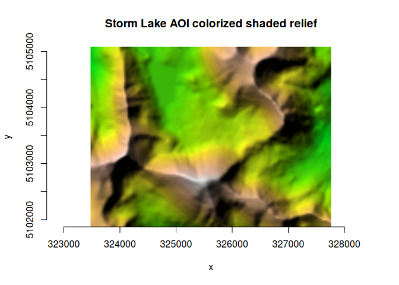
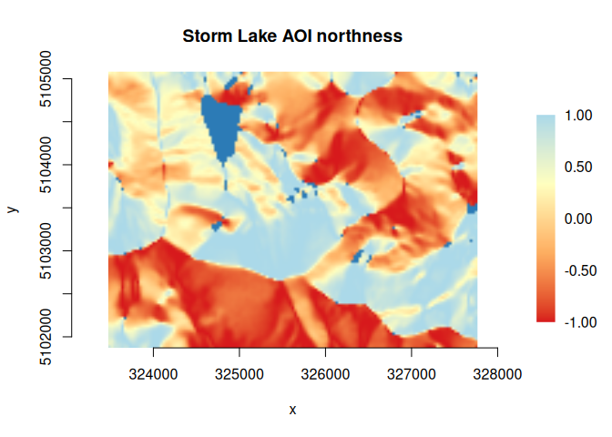

```{r, include = FALSE}
knitr::opts_chunk$set(
  collapse = TRUE,
  comment = "#>"
)
```

## Background

GDAL 3.11 added a framework for a unified command line interface (CLI) with a concept of algorithms that can be run on the command line, or that can be automatically discovered and invoked programmatically. The following resources provide information on the new CLI framework:

* [GDAL CLI Modernization](https://download.osgeo.org/gdal/presentations/GDAL%20CLI%20Modernization.pdf) (pdf slides), E. Rouault, H. Butler and D. Baston, OSGeo webinar 03-June-25
* [RFC 104](https://gdal.org/en/stable/development/rfc/rfc104_gdal_cli.html): Adding a "gdal" front-end command line interface
* GDAL programs: ["gdal" application](https://gdal.org/en/latest/programs/#gdal-application)
* cf. Python bindings: [How to use "gdal" CLI algorithms from Python](https://gdal.org/en/latest/programs/gdal_cli_from_python.html)

**gdalraster** as of version 2.2.0 provides bindings that enable access to GDAL CLI algorithms and the `GDALAlgorithm` API from R.

## Development status

The GDAL project states that the new CLI framework

> "is provisionally provided as an alternative interface to GDAL and OGR command line utilities. The project reserves the right to modify, rename, reorganize, and change the behavior until it is officially frozen via PSC vote in a future major GDAL release. The utility needs time to mature, benefit from incremental feedback, and explore enhancements without carrying the burden of full backward compatibility. Your usage of it should have no expectation of compatibility until that time." (<https://gdal.org/en/latest/programs/#gdal-application>)

The initial bindings in **gdalraster** 2.2.0 will evolve over future releases. *The bindings are considered experimental until the upstream API is declared stable*. Breaking changes in minor version releases are possible until then. Please use with those cautions in mind. Bug reports may be filed at: <https://github.com/firelab/gdalraster/issues>.

## Command discovery and usage info

The function `gdal_commands()` prints a list of available commands to the console along with a short description and help URL for each. A data frame containing the command strings, descriptions and URLs is returned invisibly. By default, the full list of available commands and their subcommands is returned. The optional argument `recurse` can be set to `FALSE` to list only the top-level commands without their subcommands.

``` r
library(gdalraster)
#> GDAL 3.12.1 (released 2025-12-12), GEOS 3.12.2, PROJ 9.4.1

## top-level commands
gdal_commands(recurse = FALSE)
#> → "convert"
#> ℹ Convert a dataset (shortcut for 'gdal raster convert' or 'gdal vector convert').
#> ℹ <https://gdal.org/programs/gdal_convert.html>
#> 
#> → "dataset"
#> ℹ Commands to manage datasets.
#> ℹ <https://gdal.org/programs/gdal_dataset.html>
#> 
#> → "driver"
#> ℹ Command for driver specific operations.
#> 
#> → "info"
#> ℹ Return information on a dataset (shortcut for 'gdal raster info' or 'gdal vector info').
#> ℹ <https://gdal.org/programs/gdal_info.html>
#> 
#> → "mdim"
#> ℹ Multidimensional commands.
#> ℹ <https://gdal.org/programs/gdal_mdim.html>
#> 
#> → "pipeline"
#> ℹ Process a dataset applying several steps.
#> ℹ <https://gdal.org/programs/gdal_pipeline.html>
#> 
#> → "raster"
#> ℹ Raster commands.
#> ℹ <https://gdal.org/programs/gdal_raster.html>
#> 
#> → "vector"
#> ℹ Vector commands.
#> ℹ <https://gdal.org/programs/gdal_vector.html>
#> 
#> → "vsi"
#> ℹ GDAL Virtual System Interface (VSI) commands.
#> ℹ <https://gdal.org/programs/gdal_vsi.html>
```

A character string can also be given to filter for commands containing specific text.

``` r
## list commands relevant to raster data
gdal_commands("raster")
#> → "raster"
#> ℹ Raster commands.
#> ℹ <https://gdal.org/programs/gdal_raster.html>
#> 
#> → "raster as-features"
#> ℹ Create features from pixels of a raster dataset
#> ℹ <https://gdal.org/programs/gdal_raster_as_features.html>
#> 
#> → "raster aspect"
#> ℹ Generate an aspect map
#> ℹ <https://gdal.org/programs/gdal_raster_aspect.html>
#> 
#> → "raster blend"
#> ℹ Blend/compose two raster datasets
#> ℹ <https://gdal.org/programs/gdal_raster_blend.html>
#> 
#> → "raster calc"
#> ℹ Perform raster algebra
#> ℹ <https://gdal.org/programs/gdal_raster_calc.html>
#> 
#> → "raster clean-collar"
#> ℹ Clean the collar of a raster dataset, removing noise.
#> ℹ <https://gdal.org/programs/gdal_raster_clean_collar.html>
#> 
#> → "raster clip"
#> ℹ Clip a raster dataset.
#> ℹ <https://gdal.org/programs/gdal_raster_clip.html>
#> 
#> → "raster color-map"
#> ℹ Generate a RGB or RGBA dataset from a single band, using a color map
#> ℹ <https://gdal.org/programs/gdal_raster_color_map.html>
#> 
#> → "raster compare"
#> ℹ Compare two raster datasets.
#> ℹ <https://gdal.org/programs/gdal_raster_compare.html>
#> 
#> → "raster contour"
#> ℹ Creates a vector contour from a raster elevation model (DEM).
#> ℹ <https://gdal.org/programs/gdal_raster_contour.html>
#> 
#> → "raster convert"
#> ℹ Convert a raster dataset.
#> ℹ <https://gdal.org/programs/gdal_raster_convert.html>
#> 
#> → "raster create"
#> ℹ Create a new raster dataset.
#> ℹ <https://gdal.org/programs/gdal_raster_create.html>
#> 
#> → "raster edit"
#> ℹ Edit a raster dataset.
#> ℹ <https://gdal.org/programs/gdal_raster_edit.html>
#> 
#> → "raster fill-nodata"
#> ℹ Fill nodata raster regions by interpolation from edges.
#> ℹ <https://gdal.org/programs/gdal_raster_fill_nodata.html>
#> 
#> → "raster footprint"
#> ℹ Compute the footprint of a raster dataset.
#> ℹ <https://gdal.org/programs/gdal_raster_footprint.html>
#> 
#> → "raster hillshade"
#> ℹ Generate a shaded relief map
#> ℹ <https://gdal.org/programs/gdal_raster_hillshade.html>
#> 
#> → "raster index"
#> ℹ Create a vector index of raster datasets.
#> ℹ <https://gdal.org/programs/gdal_raster_index.html>
#> 
#> → "raster info"
#> ℹ Return information on a raster dataset.
#> ℹ <https://gdal.org/programs/gdal_raster_info.html>
#> 
#> → "raster mosaic"
#> ℹ Build a mosaic, either virtual (VRT) or materialized.
#> ℹ <https://gdal.org/programs/gdal_raster_mosaic.html>
#> 
#> → "raster neighbors"
#> ℹ Compute the value of each pixel from its neighbors (focal statistics)
#> ℹ <https://gdal.org/programs/gdal_raster_neighbors.html>
#> 
#> → "raster nodata-to-alpha"
#> ℹ Replace nodata value(s) with an alpha band.
#> ℹ <https://gdal.org/programs/gdal_raster_nodata_to_alpha.html>
#> 
#> → "raster overview"
#> ℹ Manage overviews of a raster dataset.
#> ℹ <https://gdal.org/programs/gdal_raster_overview.html>
#> 
#> → "raster overview add"
#> ℹ Adding overviews.
#> ℹ <https://gdal.org/programs/gdal_raster_overview_add.html>
#> 
#> → "raster overview delete"
#> ℹ Deleting overviews.
#> ℹ <https://gdal.org/programs/gdal_raster_overview_delete.html>
#> 
#> → "raster overview refresh"
#> ℹ Refresh overviews.
#> ℹ <https://gdal.org/programs/gdal_raster_overview_refresh.html>
#> 
#> → "raster pansharpen"
#> ℹ Perform a pansharpen operation.
#> ℹ <https://gdal.org/programs/gdal_raster_pansharpen.html>
#> 
#> → "raster pipeline"
#> ℹ Process a raster dataset applying several steps.
#> ℹ <https://gdal.org/programs/gdal_raster_pipeline.html>
#> 
#> → "raster pixel-info"
#> ℹ Return information on a pixel of a raster dataset.
#> ℹ <https://gdal.org/programs/gdal_raster_pixel_info.html>
#> 
#> → "raster polygonize"
#> ℹ Create a polygon feature dataset from a raster band.
#> ℹ <https://gdal.org/programs/gdal_raster_polygonize.html>
#> 
#> → "raster proximity"
#> ℹ Produces a raster proximity map.
#> ℹ <https://gdal.org/programs/gdal_raster_proximity.html>
#> 
#> → "raster reclassify"
#> ℹ Reclassify values in a raster dataset
#> ℹ <https://gdal.org/programs/gdal_raster_reclassify.html>
#> 
#> → "raster reproject"
#> ℹ Reproject a raster dataset.
#> ℹ <https://gdal.org/programs/gdal_raster_reproject.html>
#> 
#> → "raster resize"
#> ℹ Resize a raster dataset without changing the georeferenced extents.
#> ℹ <https://gdal.org/programs/gdal_raster_resize.html>
#> 
#> → "raster rgb-to-palette"
#> ℹ Convert a RGB image into a pseudo-color / paletted image.
#> ℹ <https://gdal.org/programs/gdal_raster_rgb_to_palette.html>
#> 
#> → "raster roughness"
#> ℹ Generate a roughness map
#> ℹ <https://gdal.org/programs/gdal_raster_roughness.html>
#> 
#> → "raster scale"
#> ℹ Scale the values of the bands of a raster dataset.
#> ℹ <https://gdal.org/programs/gdal_raster_scale.html>
#> 
#> → "raster select"
#> ℹ Select a subset of bands from a raster dataset.
#> ℹ <https://gdal.org/programs/gdal_raster_select.html>
#> 
#> → "raster set-type"
#> ℹ Modify the data type of bands of a raster dataset.
#> ℹ <https://gdal.org/programs/gdal_raster_set_type.html>
#> 
#> → "raster sieve"
#> ℹ Remove small polygons from a raster dataset.
#> ℹ <https://gdal.org/programs/gdal_raster_sieve.html>
#> 
#> → "raster slope"
#> ℹ Generate a slope map
#> ℹ <https://gdal.org/programs/gdal_raster_slope.html>
#> 
#> → "raster stack"
#> ℹ Combine together input bands into a multi-band output, either virtual (VRT) or materialized.
#> ℹ <https://gdal.org/programs/gdal_raster_stack.html>
#> 
#> → "raster tile"
#> ℹ Generate tiles in separate files from a raster dataset.
#> ℹ <https://gdal.org/programs/gdal_raster_tile.html>
#> 
#> → "raster tpi"
#> ℹ Generate a Topographic Position Index (TPI) map
#> ℹ <https://gdal.org/programs/gdal_raster_tpi.html>
#> 
#> → "raster tri"
#> ℹ Generate a Terrain Ruggedness Index (TRI) map
#> ℹ <https://gdal.org/programs/gdal_raster_tri.html>
#> 
#> → "raster unscale"
#> ℹ Convert scaled values of a raster dataset into unscaled values.
#> ℹ <https://gdal.org/programs/gdal_raster_unscale.html>
#> 
#> → "raster update"
#> ℹ Update the destination raster with the content of the input one.
#> ℹ <https://gdal.org/programs/gdal_raster_update.html>
#> 
#> → "raster viewshed"
#> ℹ Compute the viewshed of a raster dataset.
#> ℹ <https://gdal.org/programs/gdal_raster_viewshed.html>
#> 
#> → "raster zonal-stats"
#> ℹ Calculate raster zonal statistics
#> ℹ <https://gdal.org/programs/gdal_raster_zonal_stats.html>
#> 
#> → "vector rasterize"
#> ℹ Burns vector geometries into a raster.
#> ℹ <https://gdal.org/programs/gdal_vector_rasterize.html>
```

The function `gdal_usage()` prints a help message to the console for a specific command.

``` r
gdal_usage("raster convert")
#> Usage: raster convert [OPTIONS] <INPUT> <OUTPUT>
#> 
#> Convert a raster dataset. 
#> 
#> Positional arguments:
#>   -i, --input <INPUT>
#>     Input raster dataset
#>     [required]
#>   -o, --output <OUTPUT>
#>     Output raster dataset
#>     [created by algorithm]
#>     [required]
#> 
#> Options:
#>   -f, --of, --format, --output-format <OUTPUT-FORMAT>
#>     Output format
#>   --co, --creation-option <KEY>=<VALUE>
#>     Creation option
#>     [may be repeated]
#>   --overwrite
#>     Whether overwriting existing output is allowed
#>     [default: FALSE]
#>     [mutually exclusive with --append]
#>   --append
#>     Append as a subdataset to existing output
#>     [default: FALSE]
#>     [mutually exclusive with --overwrite]
#> 
#> Advanced options:
#>   --oo, --open-option <KEY>=<VALUE>
#>     Open options
#>     [may be repeated]
#>   --if, --input-format <INPUT-FORMAT>
#>     Input formats
#>     [may be repeated]
#> 
#> 
#> For more details: https://gdal.org/programs/gdal_raster_convert.html
```

## Running CLI algorithms

A convenient way to access a CLI algorithm and run it is to use the `gdal_run()` function. This function accepts a command string, along with its argument values given in a character vector or named list. It attempts to parse the algorithm arguments and then run the algorithm on the given input data. The return value is an object of class [`GDALAlg`](https://firelab.github.io/gdalraster/reference/GDALAlg-class.html). If you do not need to access output value(s) of the algorithm, you can call `gdal_run()` without assigning its return value. More commonly, the return value is assigned to a variable so that algorithm output can be accessed via methods of the `GDALAlg` object.

### Raster examples

#### raster convert

In this example, the input and output datasets are given as positional arguments which do not have to be named. They could instead be given as named arguments if preferred for clarity.

``` r
## convert storml_elev.tif to GeoPackage raster
f_tif <- system.file("extdata/storml_elev.tif", package = "gdalraster")
f_gpkg <- file.path(tempdir(), "storml_elev.gpkg")

args <- c("--overwrite", f_tif, f_gpkg)
(alg <- gdal_run("raster convert", args))
#> 0...10...20...30...40...50...60...70...80...90...100 - done.
#> C++ object of class GDALAlg
#>  Name        : convert
#>  Description : Convert a raster dataset.
#>  Help URL    : https://gdal.org/programs/gdal_raster_convert.html

# obtain the output as a GDALRaster object
(ds <- alg$output())
#> C++ object of class GDALRaster
#>  Driver : GeoPackage (GPKG)
#>  DSN    : /tmp/Rtmp1MQDgw/storml_elev.gpkg
#>  Dim    : 143, 107, 1
#>  CRS    : NAD83 / UTM zone 12N (EPSG:26912)
#>  Res    : 30.000000, 30.000000
#>  Bbox   : 323476.071971, 5101871.983031, 327766.071971, 5105081.983031

alg$release()
```

Note that the `release()` method of the `GDALAlg` object was called after assigning its output raster dataset to a variable. The `release()` method closes datasets that were opened by the algorithm and releases resources. It is good practice to release the algorithm after assigning the output, or otherwise completing work with the `GDALAlg` object. However, if `release()` is not called explicitly, the algorithm will still be released when the object is garbage collected.

#### raster hillshade

Input datasets for algorithms can be given either as text strings as they would be in command-line usage (i.e., filename, URL, database connection string, etc.), or as objects of class `GDALRaster` or `GDALVector`. For object input, argument values must be specified in `list` form. This example uses the output elevation dataset from `"raster convert"` above to generate a hillshade raster. The output of the `"raster hillshade"` algorithm is specified as an in-memory dataset (MEM format) so the required output filename can be given as empty string (`""`).

``` r
gdal_usage("raster hillshade")
#> Usage: raster hillshade [OPTIONS] <INPUT> <OUTPUT>
#> 
#> Generate a shaded relief map 
#> 
#> Positional arguments:
#>   -i, --input <INPUT>
#>     Input raster dataset
#>     [required]
#>   -o, --output <OUTPUT>
#>     Output raster dataset
#>     [required]
#> 
#> Options:
#>   -f, --of, --format, --output-format <OUTPUT-FORMAT>
#>     Output format ("GDALG" allowed)
#>   --co, --creation-option <KEY>=<VALUE>
#>     Creation option
#>     [may be repeated]
#>   --overwrite
#>     Whether overwriting existing output is allowed
#>     [default: FALSE]
#>   -b, --band <BAND>
#>     Input band (1-based index)
#>     [default: 1]
#>   -z, --zfactor <ZFACTOR>
#>     Vertical exaggeration used to pre-multiply the elevations
#>   --xscale <XSCALE>
#>     Ratio of vertical units to horizontal X axis units
#>   --yscale <YSCALE>
#>     Ratio of vertical units to horizontal Y axis units
#>   --azimuth <AZIMUTH>
#>     Azimuth of the light, in degrees
#>     [default: 315]
#>   --altitude <ALTITUDE>
#>     Altitude of the light, in degrees
#>     [default: 45]
#>   --gradient-alg <GRADIENT-ALG>
#>     Algorithm used to compute terrain gradient
#>     [Horn|ZevenbergenThorne]
#>     [default: Horn]
#>   --variant <VARIANT>
#>     Variant of the hillshading algorithm
#>     [regular|combined|multidirectional|Igor]
#>     [default: regular]
#>   --no-edges
#>     Do not try to interpolate values at dataset edges or close to nodata values
#> 
#> Advanced options:
#>   --if, --input-format <INPUT-FORMAT>
#>     Input formats
#>     [may be repeated]
#>   --oo, --open-option <KEY>=<VALUE>
#>     Open options
#>     [may be repeated]
#> 
#> 
#> For more details: https://gdal.org/programs/gdal_raster_hillshade.html

# input as a GDALRaster object and output to an in-memory raster
args <- list(input = ds,
             output_format = "MEM",
             output = "")

alg <- gdal_run("raster hillshade", args)
#> 0...10...20...30...40...50...60...70...80...90...100 - done.

(ds_hillshade <- alg$output())
#> C++ object of class GDALRaster
#>  Driver : In Memory raster, vector and multidimensional raster (MEM)
#>  DSN    : 
#>  Dim    : 143, 107, 1
#>  CRS    : NAD83 / UTM zone 12N (EPSG:26912)
#>  Res    : 30.000000, 30.000000
#>  Bbox   : 323476.071971, 5101871.983031, 327766.071971, 5105081.983031

alg$release()

plot_raster(ds_hillshade, main = "Storm Lake AOI shaded relief")
```
```{r out.width = '80%', echo = FALSE}
#| fig.alt: >
#|   A plot of the hillshade raster, a shaded relief map, for the Storm Lake
#|   area of interest.
knitr::include_graphics("img/storml_hillshade.png")
```

``` r
# clean up
ds$close()
ds_hillshade$close()
unlink(f_gpkg)
#> [1] TRUE
```

### Vector examples

``` r
gdal_usage("vector")
#> 
#> Usage: vector <SUBCOMMAND> [OPTIONS]
#> where <SUBCOMMAND> is one of:
#>   - buffer              : Compute a buffer around geometries of a vector dataset.
#>   - check-coverage      : Check a polygon coverage for validity
#>   - check-geometry      : Check a dataset for invalid geometries
#>   - clean-coverage      : Alter polygon boundaries to make shared edges identical, removing gaps and overlaps
#>   - clip                : Clip a vector dataset.
#>   - concat              : Concatenate vector datasets.
#>   - convert             : Convert a vector dataset.
#>   - edit                : Edit metadata of a vector dataset.
#>   - explode-collections : Explode geometries of type collection of a vector dataset.
#>   - filter              : Filter a vector dataset.
#>   - geom                : Geometry operations on a vector dataset.
#>   - grid                : Create a regular grid from scattered points.
#>   - index               : Create a vector index of vector datasets.
#>   - info                : Return information on a vector dataset.
#>   - layer-algebra       : Perform algebraic operation between 2 layers.
#>   - make-point          : Create point geometries from attribute fields
#>   - make-valid          : Fix validity of geometries of a vector dataset.
#>   - partition           : Partition a vector dataset into multiple files.
#>   - pipeline            : Process a vector dataset applying several steps.
#>   - rasterize           : Burns vector geometries into a raster.
#>   - reproject           : Reproject a vector dataset.
#>   - segmentize          : Segmentize geometries of a vector dataset.
#>   - select              : Select a subset of fields from a vector dataset.
#>   - set-field-type      : Modify the type of a field of a vector dataset.
#>   - set-geom-type       : Modify the geometry type of a vector dataset.
#>   - simplify            : Simplify geometries of a vector dataset.
#>   - simplify-coverage   : Simplify shared boundaries of a polygonal vector dataset.
#>   - sql                 : Apply SQL statement(s) to a dataset.
#>   - swap-xy             : Swap X and Y coordinates of geometries of a vector dataset.
#> 
#> Options:
#>   --drivers
#>     Display vector driver list as JSON document and exit
#>   --output-string <OUTPUT-STRING>
#>     Output string, in which the result is placed
#> 
#> For more details: <https://gdal.org/programs/gdal_vector.html>
```

#### vector clip

Clip a vector layer by a bounding box.

``` r
gdal_usage("vector clip")
#> Usage: vector clip [OPTIONS] <INPUT> <OUTPUT>
#> 
#> Clip a vector dataset. 
#> 
#> Positional arguments:
#>   -i, --input <INPUT>
#>     Input vector datasets
#>     [required]
#>   -o, --output <OUTPUT>
#>     Output vector dataset
#>     [required]
#> 
#> Options:
#>   -l, --layer, --input-layer <INPUT-LAYER>
#>     Input layer name(s)
#>     [may be repeated]
#>   -f, --of, --format, --output-format <OUTPUT-FORMAT>
#>     Output format ("GDALG" allowed)
#>   --co, --creation-option <KEY>=<VALUE>
#>     Creation option
#>     [may be repeated]
#>   --lco, --layer-creation-option <KEY>=<VALUE>
#>     Layer creation option
#>     [may be repeated]
#>   --overwrite
#>     Whether overwriting existing output is allowed
#>     [default: FALSE]
#>   --update
#>     Whether to open existing dataset in update mode
#>     [default: FALSE]
#>   --overwrite-layer
#>     Whether overwriting existing layer is allowed
#>     [default: FALSE]
#>   --append
#>     Whether appending to existing layer is allowed
#>     [default: FALSE]
#>   --output-layer <OUTPUT-LAYER>
#>     Output layer name
#>   --active-layer <ACTIVE-LAYER>
#>     Set active layer (if not specified, all)
#>   --bbox <BBOX>
#>     Clipping bounding box as xmin,ymin,xmax,ymax
#>     [4 values]
#>     [mutually exclusive with --geometry, --like]
#>   --bbox-crs <BBOX-CRS>
#>     CRS of clipping bounding box
#>   --geometry <GEOMETRY>
#>     Clipping geometry (WKT or GeoJSON)
#>     [mutually exclusive with --bbox, --like]
#>   --geometry-crs <GEOMETRY-CRS>
#>     CRS of clipping geometry
#>   --like <DATASET>
#>     Dataset to use as a template for bounds
#>     [mutually exclusive with --bbox, --geometry]
#>   --like-sql <SELECT-STATEMENT>
#>     SELECT statement to run on the 'like' dataset
#>     [mutually exclusive with --like-where]
#>   --like-layer <LAYER-NAME>
#>     Name of the layer of the 'like' dataset
#>   --like-where <WHERE-EXPRESSION>
#>     WHERE SQL clause to run on the 'like' dataset
#>     [mutually exclusive with --like-sql]
#> 
#> Advanced options:
#>   --if, --input-format <INPUT-FORMAT>
#>     Input formats
#>     [may be repeated]
#>   --oo, --open-option <KEY>=<VALUE>
#>     Open options
#>     [may be repeated]
#> 
#> 
#> For more details: https://gdal.org/programs/gdal_vector_clip.html

dsn <- system.file("extdata/ynp_fires_1984_2022.gpkg", package = "gdalraster")
dsn_out <- file.path(tempdir(), "ynp_fires_clip.gpkg")

bb <- c(469686, 11442, 544070, 85508)

args <- list(bbox = bb,
             input = dsn,
             output = dsn_out,
             overwrite = TRUE)
             
alg <- gdal_run("vector clip", args)

(lyr <- alg$output())
#> C++ object of class GDALVector
#>  Driver : GeoPackage (GPKG)
#>  DSN    : /tmp/Rtmp6F8oeQ/ynp_fires_clip.gpkg
#>  Layer  : mtbs_perims
#>  CRS    : NAD83 / Montana (EPSG:32100)
#>  Geom   : MULTIPOLYGON

lyr$bbox()
#> [1] 469686  11442 544070  85508

lyr$getFeatureCount()
#> [1] 40

# clean up
lyr$close()
alg$release()
unlink(dsn_out)
```

#### vector rasterize

Rasterize a vector layer given as a `GDALVector` object.

``` r
gdal_usage("vector rasterize")
#> Usage: vector rasterize [OPTIONS] <INPUT> <OUTPUT>
#> 
#> Burns vector geometries into a raster. 
#> 
#> Positional arguments:
#>   -i, --input <INPUT>
#>     Input vector dataset
#>     [required]
#>   -o, --output <OUTPUT>
#>     Output raster dataset
#>     [required]
#> 
#> Options:
#>   -f, --of, --format, --output-format <OUTPUT-FORMAT>
#>     Output format
#>   --co, --creation-option <KEY>=<VALUE>
#>     Creation option
#>     [may be repeated]
#>   -b, --band <BAND>
#>     The band(s) to burn values into (1-based index)
#>     [may be repeated]
#>   --invert
#>     Invert the rasterization
#>     [default: FALSE]
#>   --all-touched
#>     Enables the ALL_TOUCHED rasterization option
#>   --burn <BURN>
#>     Burn value
#>     [may be repeated]
#>   -a, --attribute-name <ATTRIBUTE-NAME>
#>     Attribute name
#>   --3d
#>     Indicates that a burn value should be extracted from the Z values of the feature
#>   --add
#>     Add to existing raster
#>     [default: FALSE]
#>   -l, --layer, --layer-name <LAYER-NAME>
#>     Layer name
#>     [mutually exclusive with --sql]
#>   --where <WHERE>
#>     SQL where clause
#>   --sql <SQL>
#>     SQL select statement
#>     [mutually exclusive with --layer-name]
#>   --dialect <DIALECT>
#>     SQL dialect
#>   --nodata <NODATA>
#>     Assign a specified nodata value to output bands
#>   --init <INIT>
#>     Pre-initialize output bands with specified value
#>     [may be repeated]
#>   --crs <CRS>
#>     Override the projection for the output file
#>   --transformer-option <NAME>=<VALUE>
#>     Set a transformer option suitable to pass to GDALCreateGenImgProjTransformer2
#>     [may be repeated]
#>   --extent <xmin>,<ymin>,<xmax>,<ymax>
#>     Set the target georeferenced extent
#>     [4 values]
#>   --resolution <xres>,<yres>
#>     Set the target resolution
#>     [2 values]
#>     [mutually exclusive with --size]
#>   --tap, --target-aligned-pixels
#>     (target aligned pixels) Align the coordinates of the extent of the output file to the values of the resolution
#>   --size <xsize>,<ysize>
#>     Set the target size in pixels and lines
#>     [2 values]
#>     [mutually exclusive with --resolution]
#>   --ot, --datatype, --output-data-type <OUTPUT-DATA-TYPE>
#>     Output data type
#>     [Byte|Int8|UInt16|Int16|UInt32|Int32|UInt64|Int64|CInt16|CInt32|Float16|Float32|Float64|CFloat32|CFloat64]
#>   --optimization <OPTIMIZATION>
#>     Force the algorithm used (results are identical)
#>     [AUTO|RASTER|VECTOR]
#>     [default: AUTO]
#>   --update
#>     Whether to open existing dataset in update mode
#>     [default: FALSE]
#>   --overwrite
#>     Whether overwriting existing output is allowed
#>     [default: FALSE]
#> 
#> Advanced options:
#>   --oo, --open-option <KEY>=<VALUE>
#>     Open options
#>     [may be repeated]
#>   --if, --input-format <INPUT-FORMAT>
#>     Input formats
#>     [may be repeated]
#> 
#> 
#> For more details: https://gdal.org/programs/gdal_vector_rasterize.html

dsn <- system.file("extdata/ynp_fires_1984_2022.gpkg", package = "gdalraster")
sql <- "SELECT incid_name, ig_year, geom FROM mtbs_perims ORDER BY ig_year"
(lyr <- new(GDALVector, dsn, sql))
#> C++ object of class GDALVector
#>  Driver : GeoPackage (GPKG)
#>  DSN    : /usr/local/lib/R/site-library/gdalraster/extdata/ynp_fires_1984_2022.gpkg
#>  Layer  : SELECT incid_name, ig_year, geom FROM mtbs_perims ORDER BY ig_year
#>  CRS    : NAD83 / Montana (EPSG:32100)
#>  Geom   : MULTIPOLYGON

f_out = file.path(tempdir(), "ynp_fire_year.tif")

# note that the "sql" argument is obtained from the input GDALVector object
args <- list(input = lyr,
             attribute_name = "ig_year",
             output = f_out,
             overwrite = TRUE,
             creation_option = c("TILED=YES", "COMPRESS=DEFLATE"),
             resolution = c(90, 90),
             output_data_type = "Int16",
             init = -32767,
             nodata = -32767)

alg <- gdal_run("vector rasterize", args)
#> 0...10...20...30...40...50...60...70...80...90...100 - done.

(ds <- alg$output())
#> C++ object of class GDALRaster
#>  Driver : GeoTIFF (GTiff)
#>  DSN    : /tmp/Rtmp3vFo18/ynp_fire_year.tif
#>  Dim    : 1155, 1218, 1
#>  CRS    : NAD83 / Montana (EPSG:32100)
#>  Res    : 90.000000, 90.000000
#>  Bbox   : 469640.726682, -12997.663642, 573590.726682, 96622.336358

alg$release()

pal <- scales::viridis_pal(end = 0.8, direction = -1)(6)
ramp <- scales::colour_ramp(pal)
plot_raster(ds, legend = TRUE, col_map_fn = ramp, na_col = "#d9d9d9",
            main = "YNP Fires 1984-2022 - Most Recent Burn Year")
```
```{r out.width = '80%', echo = FALSE}
#| fig.alt: >
#|   A plot of fire perimeters in Yellowstone National Park during 1984 through
#|   2022. A color ramp is used to indicate the burn year as depicted in a
#|   legend on the right-hand side of the plot. The most recent burn year is
#|   shown in cases where fire perimeters overlap.
knitr::include_graphics("img/ynp_fire_year.png")
```

``` r
lyr$close()
ds$close()
deleteDataset(f_out)
#> [1] TRUE
```

### Pipeline examples

#### Colorized shaded relief

A raster pipline to create a color shaded relief file, based on Example 3 for [GDAL nested pipeline](https://gdal.org/en/latest/programs/gdal_pipeline.html#nested-pipeline).

``` r
# requires GDAL >= 3.12.1 for nested pipelines and "raster blend"
library(gdalraster)
#> GDAL 3.12.1 (released 2025-12-12), GEOS 3.12.2, PROJ 9.4.1

# gdal_usage("raster pipeline")
# gdal_usage("raster color-map")
# gdal_usage("raster hillshade")
# gdal_usage("raster blend")

# make a working copy the Storm Lake DEM since GDAL will compute stats on it
# (which creates a .aux.xml sidecar file in the read-only case)
f <- system.file("extdata/storml_elev.tif", package="gdalraster")
f_elev <- tempfile(fileext = ".tif")
file.copy(f, f_elev)
#> [1] TRUE

# this is a color map file for passing to "raster color-map"
# see https://gdal.org/programs/gdal_raster_color_map.html
f_pal <- system.file("extdata/storml_elev_pal.txt", package="gdalraster")
# writeLines(readLines(f_pal))

# output will be an RGB shaded relief file
f_out <- file.path(tempdir(), "storml_col_relief.tif")

# arguments for "raster pipeline", using a nested input pipeline for "blend"
args <- paste(
    "read --input", f_elev,
    "! color-map --color-map", f_pal,
    "! blend --overlay [ read --input", f_elev, "! hillshade -z 1.5 ] --operator=hsv-value",
    "! write --output", f_out, "--overwrite")

(alg <- gdal_run("raster pipeline", args))
#> ✔ Done (12ms)
#> 
#> C++ object of class <GDALAlg>
#> • Command: "raster pipeline"
#> • Description: Process a raster dataset applying several steps.
#> • Help URL: <https://gdal.org/programs/gdal_raster_pipeline.html>

# note that the "pipeline" algorithm has two outputs: the `output` dataset, and
# `output_string` (which is empty in this case)
alg$outputs()
#> $output
#> C++ object of class <GDALRaster>
#>   • Driver: GeoTIFF (GTiff)
#>   • DSN: "/tmp/Rtmpd9pug9/storml_col_relief.tif"
#>   • Dimensions: 143, 107, 3
#>   • CRS: NAD83 / UTM zone 12N (EPSG:26912)
#>   • Pixel resolution: 30.000000, 30.000000
#>   • Bbox: 323476.071971, 5101871.983031, 327766.071971, 5105081.983031
#> 
#> $output_string
#> [1] ""

ds <- alg$outputs()$output

alg$release()

plot_raster(ds, main = "Storm Lake AOI colorized shaded relief")
```

```{r out.width = '80%', echo = FALSE}
#| fig.alt: >
#|   A plot of the colorized shaded relief map for the Storm Lake area of
#|   interest. Lower elevation areas are green, transitioning to yellow then
#|   light brown, pinkish and almost white at the highest elevations.

```

``` r
# cleanup
ds$close()
deleteDataset(f_elev)
#> [1] TRUE
deleteDataset(f_out)
#> [1] TRUE
```

#### Nested input pipelines in raster calc

Compute slope-masked aspect for the Storm Lake AOI, and plot as "northness" (see `?gdalraster::northness`). Based on Example 6 for [`gdal raster calc`](https://gdal.org/programs/gdal_raster_calc.html).

``` r
# requires GDAL >= 3.12.1 for nested pipelines
library(gdalraster)
#> GDAL 3.12.1 (released 2025-12-12), GEOS 3.12.2, PROJ 9.4.1

f_elev <- system.file("extdata/storml_elev.tif", package="gdalraster")

# gdal_usage("raster calc")

# using nested pipelines (GDAL >= 3.12.1) for calc inputs SLOPE and ASPECT
# output to an in-memory raster
args <- c(
    "--input", paste("SLOPE=[ read", f_elev, "! slope ]"),
    "--input", paste("ASPECT=[ read", f_elev, "! aspect ]"),
    "--output", "masked-aspect",
    "--output-format", "MEM",
    "--calc", "(SLOPE >= 2) ? ASPECT : -9999",
    "--nodata", -9999)

alg <- gdal_run("raster calc", args)
#> ✔ Done (13ms)

(ds <- alg$output())
#> C++ object of class <GDALRaster>
#> • Driver: In Memory raster, vector and multidimensional raster (MEM)
#> • DSN: "masked-aspect"
#> • Dimensions: 143, 107, 1
#> • CRS: NAD83 / UTM zone 12N (EPSG:26912)
#> • Pixel resolution: 30.000000, 30.000000
#> • Bbox: 323476.071971, 5101871.983031, 327766.071971, 5105081.983031

alg$release()

# diverging palette for northness
# adapted from "heatmap3" in ltc-color-palettes
# https://github.com/loukesio/ltc-color-palettes
pal <- c("#d7191c", "#fdae61", "#ffffbf", "#abd9e9")

# transform the pixel values with `gdalraster::northness()`
plot_raster(ds, legend = TRUE, col_map_fn = pal, pixel_fn = northness,
            na_col = "#2c7bb6", main = "Storm Lake AOI northness")
```

```{r out.width = '80%', echo = FALSE}
#| fig.alt: >
#|   A plot of "northness" for the Storm Lake area of interest. The pixel values
#|   range from -1 (due south) to 1 (due north), with a diverging heatmap color
#|   gradient ranging from warm reddish colors on south aspects to cool light
#|   blue on north aspects. Flat areas are masked out from the aspect layer and
#|   have a darker blue color since these are mostly water.

```

``` r
ds$close()
```

## See also

**gdalraster** documentation:

* Functions for using "gdal" CLI algorithms (`?gdal_cli`)
* Class `GDALAlg` (`?GDALAlg`)
